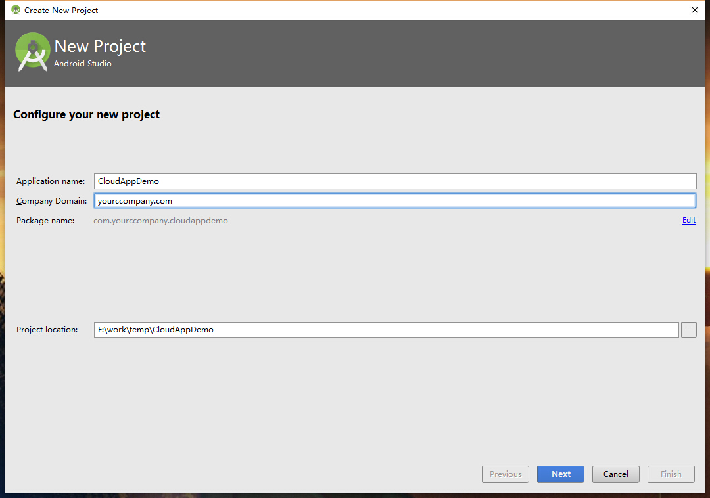
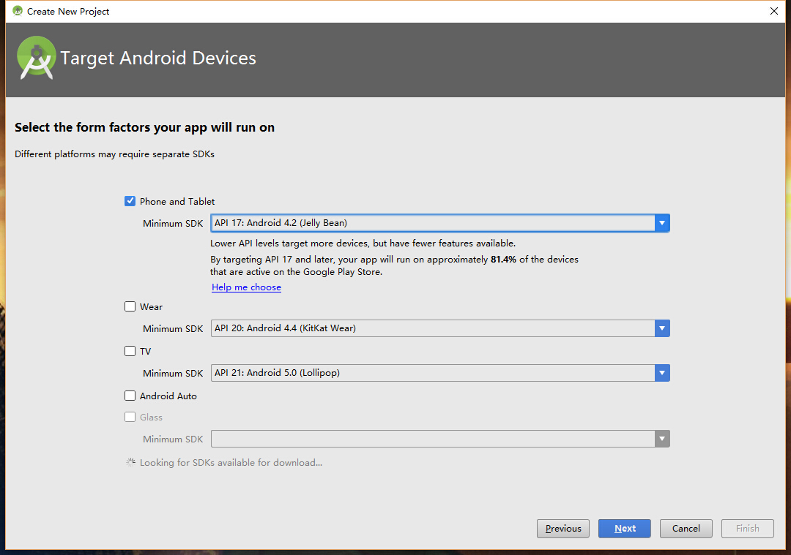
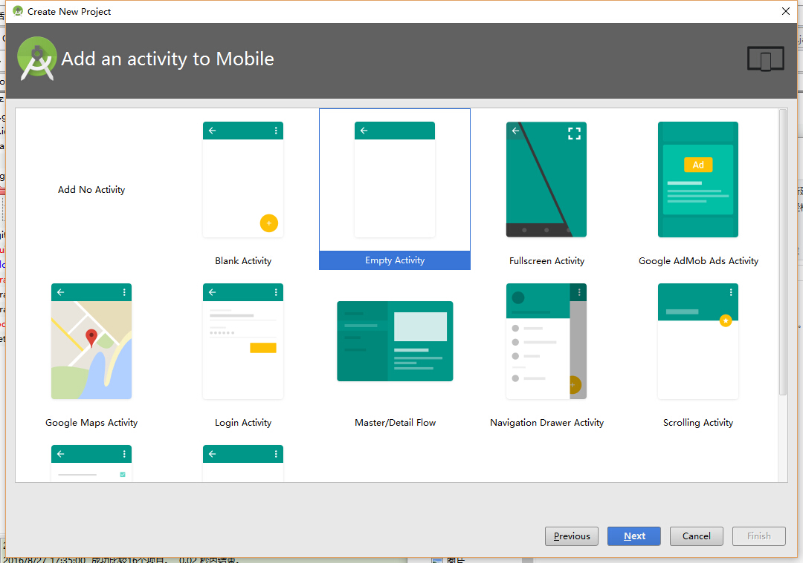
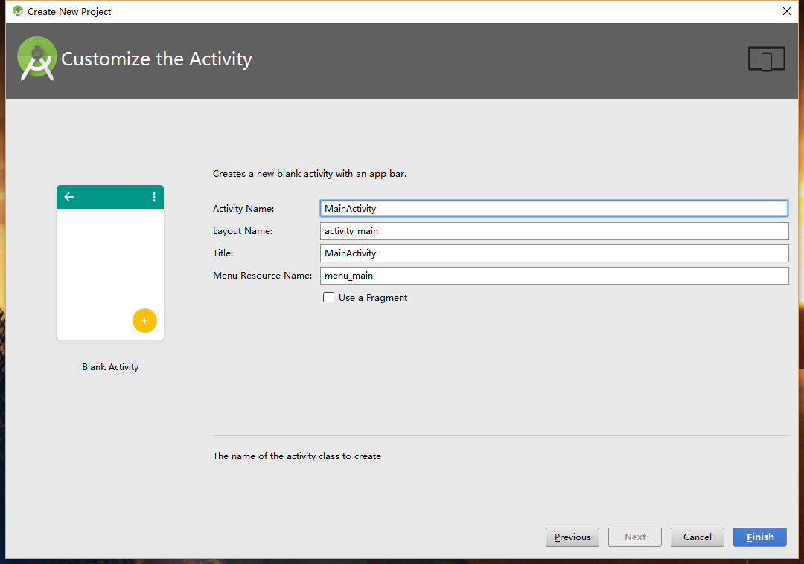
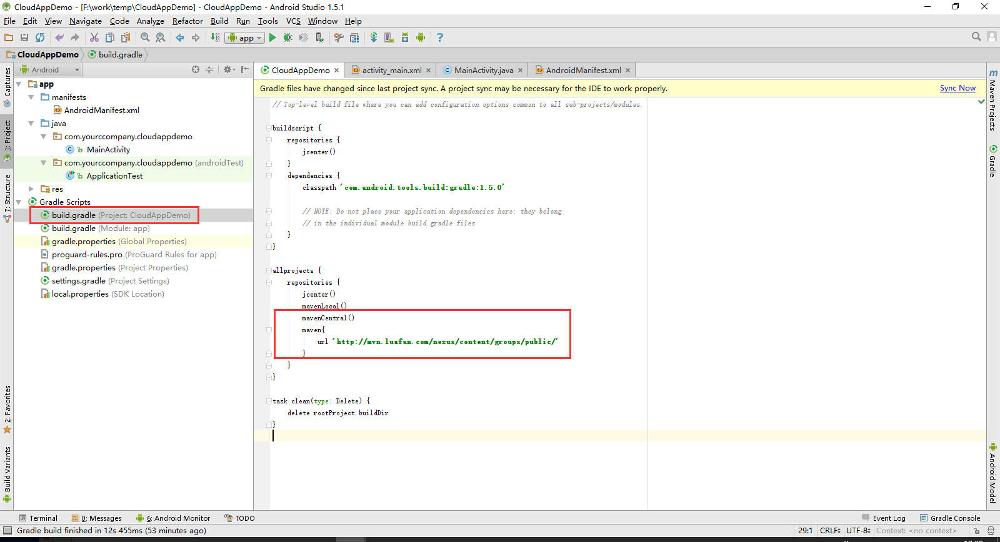
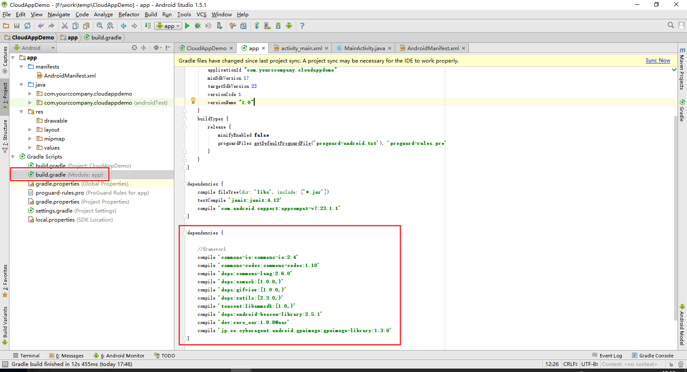
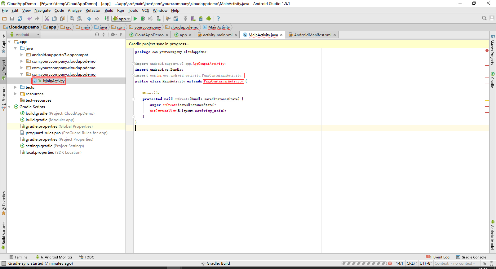
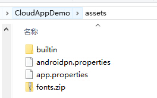
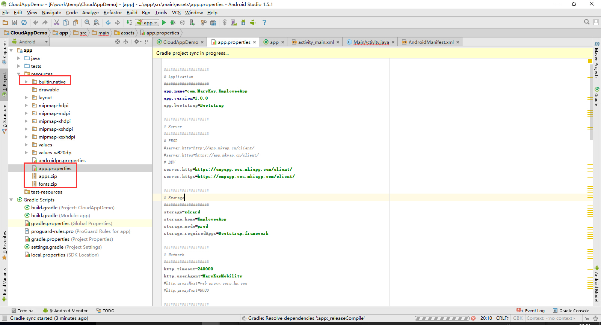

### 创建第一个Android项目
##### 1. 创建Android新项目
1. 启动Android Studio,选择"Start a new Android Studio project",如下图：


2. 填写Application Name,Company Domain, Project location, 如下图:


3. 选择Phone and Tablet


4. 选择Empty Activity


5. 最后点击Finish,完成项目配置


##### 2. 修改配置
1. 配置maven,`CloudAppDemo\build.gradle`下添加如下语句：
```java
mavenLocal()
     mavenCentral()
     maven{
         url 'http://mvn.luafan.com/nexus/content/groups/public/'
     }
```


2. 配置依赖库,`CloudAppDemo\app\build.gradle`下添加如下语句：
```java
dependencies {

    //framework
    compile 'commons-io:commons-io:2.4'
    compile 'commons-codec:commons-codec:1.10'
    compile 'deps:commons-lang:2.6.0'
    compile 'deps:asmack:[1.0.0,)'
    compile 'deps:gifview:[1.0.0,)'
    compile 'deps:xutils:[2.3.0,)'
    compile 'tencent:libammsdk:[1.0,)'
    compile 'deps:android-beacon-library:2.5.1'
    compile 'dev:core_aar:1.9.8@aar'
    compile 'jp.co.cyberagent.android.gpuimage:gpuimage-library:1.3.0'
}
```


3. 修改MainActivity.java，如下

  ```java
  package com.yourccompany.cloudappdemo;

  import android.support.v7.app.AppCompatActivity;
  import android.os.Bundle;
  import com.hp.eos.android.activity.PageContainerActivity;
  public class MainActivity extends PageContainerActivity {

      @Override
      protected void onCreate(Bundle savedInstanceState) {
          super.onCreate(savedInstanceState);
          setContentView(R.layout.activity_main);
      }
  }
  ```

  
4. 拷贝assets到CloudApp目录下，并添加到工程中

  
5. 修改app.properties,配置CloudApp Server的相关参数

  
