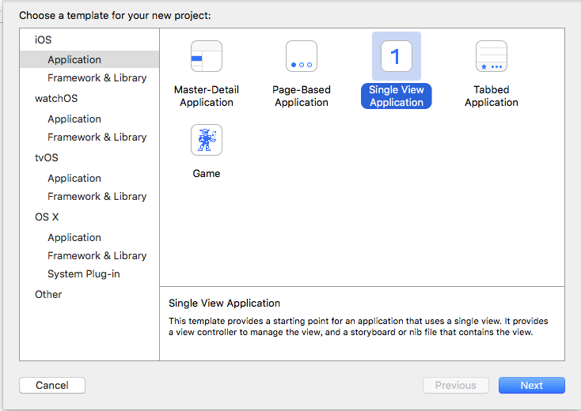
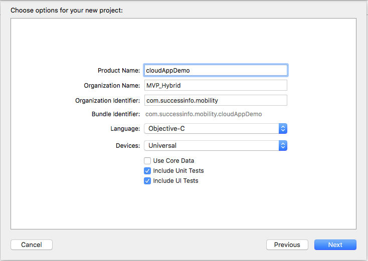
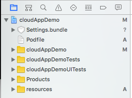
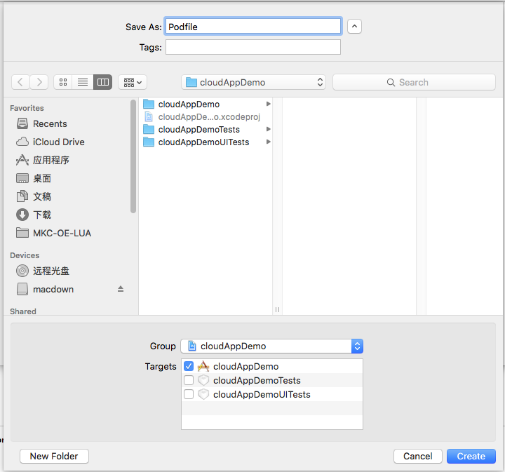
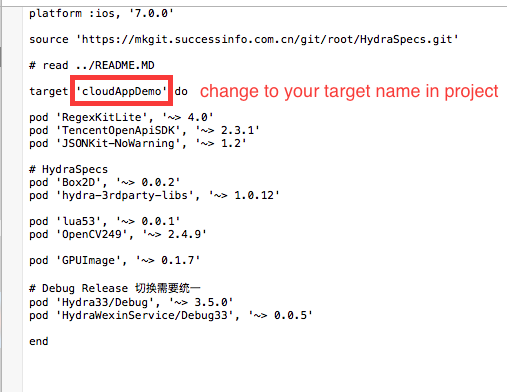
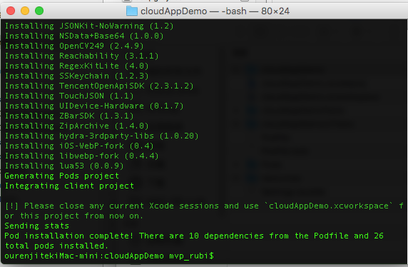
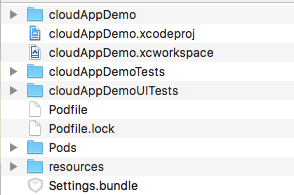
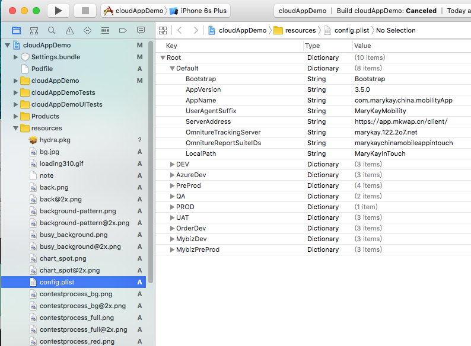

### 客户端项目创建及配置
#### 创建第一个iOS CloudApp
##### 1. 创建Xcode新项目
选择Single View Application模板创建新项目，如图

创建你自己的项目名字

##### 2. 删除缺省的controller和storyboard，如图

##### 3. 拷贝相关文件
拷贝AppDelete.m/h的内容到新的Appdelegate.m/h里，拷贝resources资源文件目录和Settings.bundle到Project，如图

##### 5. 创建Podfile文件
创建一个空白文件，取名为Podfile，如图

拷贝podfile内容到新创建的Podfile里，注意target name，如图

##### 7. 安装第三方支持库
由于Cloud App使用的第三方库使用cocoapods仓库管理，所以首先确保您的mac电脑上已经部署cocoapods，如果未部署请按照下面步骤安装cocoapods
```
$gem sources --remove https://rubygems.org/
$gem sources -a http://ruby.taobao.org/
$sudo gem install cocoapods
```
使用cocoapods下载安装第三方支持库
```
$pod install
```
安装过程如图

安装完毕后，会自动生成xcworkspace文件，运行该文件打开项目，如图

#### 配置iOS Project
打开config.plist文件来进行相关设置，如图

